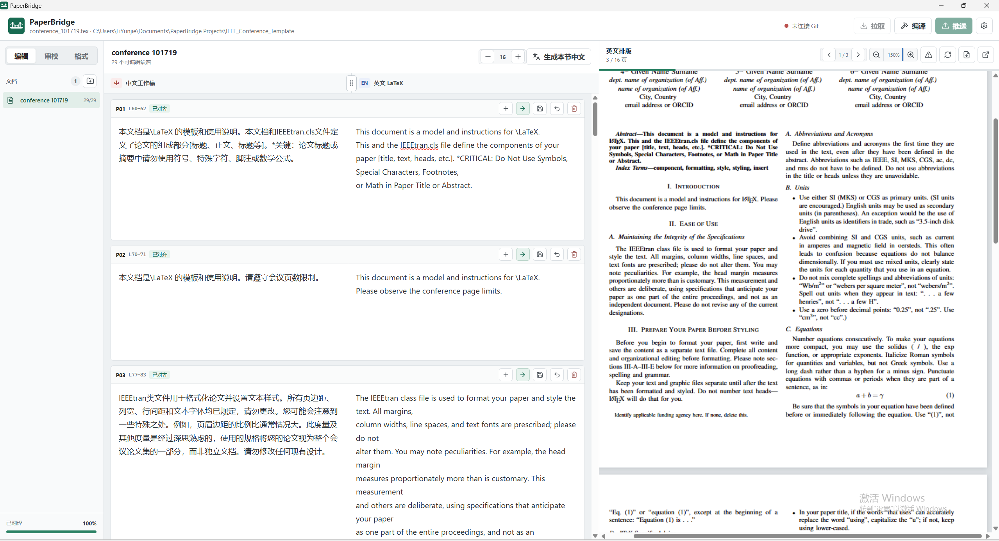
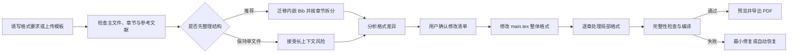

# PaperBridge

PaperBridge 是一个运行在 Windows 本地的中英文 LaTeX 论文修改工具。

它适合需要反复修改英文论文、但更习惯先用中文组织和调整内容的研究者。使用时可以修改中文工作稿，由 AI 更新对应的英文 LaTeX，并随时在 PDF 预览中检查英文版本的实际排版。英文 LaTeX 始终是最终排版依据，因此页数变化、公式或引用异常、段落换页，以及图片和表格位置变化都能及时发现。

PaperBridge 不代替作者决定论文内容。它用于保持中文修改、英文表达和 LaTeX 排版之间的对应关系，让多轮修改更容易检查和管理。



> 示意图使用单独授权的模板项目。

## 主要功能

- 以段落为单位维护中文工作稿和英文 LaTeX，只翻译用户指定的段落或章节，避免不必要的全文调用。
- 支持新增、删除和重新翻译段落，也可以直接修改英文或 TeX / Bib 源码。
- 实时编译并预览英文 PDF，支持 `Ctrl+鼠标滚轮` 缩放、页面拖动、编辑区宽度调整和一键导出。
- 双击 PDF 文字时优先定位对应的中英文段落；没有翻译段落时自动定位到 TeX 源码行。
- 导入 ZIP 或本地项目时，自动排除导言区、作者信息、宏定义、公式、图表、算法代码和参考文献等不需要翻译的内容。
- 编译出现致命错误时，由 AI 结合错误日志和报错行附近源码给出定位与修改建议，但不会自动改写源码。
- 支持 Overleaf Git，以及 GitHub、GitLab 等 HTTPS Git 仓库的拉取和推送。
- 支持 OpenAI 兼容接口、DeepSeek、Anthropic 和 Gemini，可分别配置翻译模型与审校模型。
- 支持根据文字要求或 Word、PDF、TeX、ZIP 模板分析并迁移论文格式。
- 写入前检查危险 LaTeX 命令、正文完整性、引用、标签和图片路径；关键操作失败时自动恢复。

## 安装

Windows 只提供一个完整安装版：[下载 PaperBridge 0.3.2 Windows 安装程序](https://github.com/liyunjie-phd/PaperBridge/releases/download/v0.3.2/PaperBridge-Setup.exe)。

安装程序包含 PaperBridge、Git 和 Tectonic，不需要另行安装 Node.js。电脑已经安装 TeX Live 或 MiKTeX，并且可以使用 `latexmk` 时，PaperBridge 会优先使用本机 LaTeX；否则自动使用内置 Tectonic。

安装时可以选择程序安装目录。首次启动时还可以单独选择数据目录，用于保存设置、中文工作稿、源码备份和导入的论文项目，数据目录之后也可以在设置中迁移到其他磁盘。

当前版本没有商业代码签名证书。Windows 首次运行时可能显示“Windows 已保护你的电脑”。确认安装包来源和 SHA-256 后，可以选择 **更多信息 > 仍要运行**。

可以从 Windows 的 **设置 > 应用 > 已安装的应用** 中卸载 PaperBridge。卸载时可以选择保留数据，也可以删除 PaperBridge 数据目录中的项目、工作稿、备份、设置和缓存。

## 基础配置

### 1. 选择论文来源

首次启动时可以选择四种来源：

| 来源 | 适用情况 | 需要填写或选择 |
| --- | --- | --- |
| Overleaf | 账户和项目已经开通 Overleaf Git | 项目链接、Overleaf Git Token |
| Git 仓库 | 论文已经保存在 GitHub 或 GitLab | HTTPS 仓库地址；私有仓库还需要用户名和 Token |
| ZIP 文件 | 从 Overleaf 下载项目，或没有 Overleaf Git 权限 | 本地 `.zip` 文件 |
| 本地文件夹 | 论文已经保存在电脑中 | 本地 LaTeX 项目目录 |

ZIP 和本地文件夹可以选择同时连接一个 GitHub 或 GitLab 仓库。导入时只建立连接，不会立即上传；首次推送前会显示完整文件清单，默认只选择 TeX、Bib、样式文件和图片等论文文件。

如果项目中存在多个带 `\documentclass` 的完整 TeX 文件，PaperBridge 会要求选择主文件。应选择与 Overleaf 菜单中 **Main document** 相同的文件，不能只根据文件是否叫 `main.tex` 判断。之后可以在设置中切换主 TeX 文件，也可以通过左侧“文档”旁的文件夹加号切换论文项目。

### 2. 配置 Overleaf Git

Overleaf Git 集成通常需要个人订阅、团队订阅或学校提供的 Overleaf Commons 权限。可以在项目左侧的 **Integrations > Git** 中确认是否已经开通，详细说明见 [Overleaf Git integration](https://docs.overleaf.com/integrations-and-add-ons/git-integration-and-github-synchronization/git-integration)。

获取 Git Token：

1. 登录 Overleaf。
2. 打开 [Overleaf Account Settings](https://cn.overleaf.com/user/settings)。
3. 找到 **Git integration authentication tokens**。
4. 生成新的 Token，并填入 PaperBridge 的 **Overleaf Git Token**。

PaperBridge 会在本机加密保存 Token，并在拉取和推送时自动使用，不需要再输入 Git 密码。Token 与密码具有相同的访问能力，请不要截图、上传或发送给他人。

如果出现 `no git access`、`repository not found` 或“项目没有 Git 访问权限”，常见原因是项目链接错误、项目不存在、当前账户没有项目权限，或者项目没有开通 Overleaf Git。没有该功能时，可以从 Overleaf 下载 ZIP 后导入。

### 3. 配置 AI 接口

PaperBridge 支持 OpenAI 兼容接口、Anthropic Messages 和 Gemini GenerateContent。首次配置会将同一接口用于段落翻译和全文审校，之后可以在设置中分别调整。

以 DeepSeek 为例：

1. 登录 [DeepSeek 开放平台](https://platform.deepseek.com/)。
2. 在 [API Keys](https://platform.deepseek.com/api_keys) 创建 API Key。
3. 在 [Usage](https://platform.deepseek.com/usage) 查看余额和用量。
4. 在 PaperBridge 中选择 DeepSeek / OpenAI 兼容接口，填写 Base URL 和 API Key，然后点击 **测试连接**。

| 设置项 | 示例 |
| --- | --- |
| API 服务类型 | `DeepSeek / OpenAI 兼容接口` |
| 模型 | 从下拉框选择，或使用接口提供方要求的自定义模型名 |
| Base URL | `https://api.deepseek.com` |
| API Key | 在 DeepSeek 开放平台创建的 Key |

API Key 只应保存在自己的电脑中，不要提交到 GitHub，也不要随论文项目发送给他人。

### 4. 配置 GitHub 或 GitLab

PaperBridge 目前支持 HTTPS 仓库，不支持 SSH 地址。公开仓库可以不填写 Token；私有仓库需要 Git 用户名和 Personal Access Token。Token 在 Windows 本地加密保存，不会写入论文目录或 Git 远端地址。

如果远端仓库已经存在与本地无关的提交历史，PaperBridge 会拒绝覆盖。此时应从 **Git 仓库** 来源克隆远端，再手动合并论文文件，而不是将本地项目直接推送到该仓库。

## 日常论文修改工作流

1. **导入并检查项目**：选择论文来源和主 TeX 文件，先确认项目可以正常编译并显示 PDF。
2. **准备中文工作稿**：选择当前 TeX 文件中的章节批量生成中文，或者只点击某个段落的语言按钮。已有中文的段落不会重复调用接口。
3. **逐段修改**：在左侧修改中文，点击右箭头只更新当前段落的英文 LaTeX。也可以新增或删除段落，或者直接修改右侧英文。
4. **随时检查排版**：以右侧 PDF 为准检查页数、换页、公式、引用、图片和表格位置。双击 PDF 文字可以返回对应段落；找不到翻译段落时会打开 TeX 源码。
5. **处理简单源码问题**：进入 **TeX** 页面编辑当前项目引用的 `.tex` 和 `.bib` 文件，使用 `Ctrl+S` 保存并重新编译。每个源码文件最多保留最近 3 份备份。
6. **处理编译错误**：打开右侧编译信息，查看 AI 给出的文件、行号、原因和建议；点击位置后人工确认并修改源码。相同错误会复用本地诊断缓存。
7. **完成全文检查**：进入 **审校** 页面检查英文语法、术语一致性、段落衔接和全文连贯性，再逐项决定是否采用建议。
8. **同步与交付**：确认 PDF 后导出文件；使用 Overleaf 或普通 Git 仓库时，再执行拉取、检查和推送。

## 格式迁移工作流

格式迁移用于将现有论文调整到新的会议或期刊模板。目标不是让 AI 重新生成整篇论文，而是识别当前格式与目标格式之间的差异，并通过可校验的局部操作修改 TeX。



### 1. 提供目标格式

进入 **格式** 页面，可以同时使用两类依据：

- 在文本框中描述会议或期刊要求，例如单双栏、纸张、页边距、字体、字号、标题和参考文献样式。
- 上传从官网获得的 Word、PDF、TeX 或 ZIP 模板。ZIP 可以包含完整 LaTeX 模板、类文件和样式文件。

建议优先使用会议或期刊官网提供的原始模板，并补充无法从模板中直接判断的要求。

### 2. 检查论文结构

点击分析后，PaperBridge 会先检查主 TeX、章节和参考文献组织方式，不会立即修改格式。

- 如果检测到内嵌 `thebibliography` 或 `filecontents`，可以先一键迁移到独立 `.bib`。引用键和原始文献文本会保留，不会让 AI 猜测缺失的作者、题名、期刊或 DOI。
- 如果正文集中在一个较长的 `main.tex` 中，推荐一键按顶层 `\section` 拆成章节文件。`main.tex` 保留全局排版、宏包和 Bib 调用，章节文件保留正文、公式、图片和表格。
- 也可以选择不拆分继续，但长论文可能超过模型上下文限制，导致分析不完整或迁移失败。

参考文献迁移和章节拆分都会先显示文件清单，确认后才写入，并在写入后重新编译。失败时自动恢复，不会留下拆到一半的项目。

### 3. 分析格式差异

结构确认后，PaperBridge 调用配置的审校 API，比较目标模板、文字要求和当前项目，生成：

- 目标格式名称和摘要；
- 当前格式与目标格式的差异；
- 预计修改的文件和阶段；
- 可能影响编译、篇幅或排版的警告。

分析阶段只生成计划，不写入论文。用户应先检查差异是否符合目标会议或期刊要求，再点击应用。

### 4. 分阶段应用修改

格式迁移按照“整体格式、章节局部格式、参考文献独立保留”的顺序执行：

1. 先修改 `main.tex` 中的 `documentclass`、单双栏、纸张、页边距、字体、字号、宏包和参考文献样式等全局设置。
2. 再逐个章节处理标题层级、局部环境以及模板要求的正文结构。
3. `.bib` 条目不会交给格式模型重写，图片文件也不会被 AI 替换或重新生成。

每次模型调用只包含当前阶段和当前文件所需的上下文，不会让模型一次重写整个项目。这种方式既减少 token，也能让相对较弱的模型完成基础格式迁移。

### 5. 本地校验、修复与恢复

模型返回的每项修改都必须通过本地校验：

- 定位文本必须存在且唯一，不能依靠模糊替换大段源码。
- 危险 LaTeX 命令会被直接拦截；新增非预期命令时必须人工确认。
- 正文、引用、标签、公式环境和图片路径不能无故丢失。
- 局部章节不能擅自加入只应出现在主文件中的全局命令。

模型输出格式错误或定位失败时，PaperBridge 会把校验原因反馈给模型并重试。应用完成后会重新编译；如果出现致命错误，最多进行两次基于编译日志的最小修复。完整性检查不通过或最终仍无法编译时，本次格式迁移会自动恢复全部文件。

### 6. 人工验收与导出

格式迁移成功只表示项目通过了结构检查和本地编译。提交前仍应人工检查：

- 会议或期刊规定的页数、单双栏、纸张和字体；
- 标题、作者、单位、摘要、关键词和版权信息；
- 公式编号、交叉引用、参考文献样式和引用顺序；
- 图片清晰度、浮动位置、表格宽度和跨栏效果。

确认无误后，可以在 PaperBridge 中一键导出 PDF，或将 TeX 项目推送回 Overleaf 继续检查。

## 数据位置与隐私

- PaperBridge 在 Windows 本地运行并编译 LaTeX。
- 只有翻译、审校、编译诊断或格式分析所需的文字会发送给用户配置的 AI API。
- 编译诊断只发送错误日志、报错行附近源码和必要的 LaTeX 配置，不发送无关的完整正文。
- API Key、Overleaf Git Token 和 GitHub/GitLab Token 在桌面版本中通过 Windows 安全存储加密。
- 中文工作稿和源码备份位于 PaperBridge 数据目录，不写入英文论文的 Git 仓库。
- 中文工作稿按项目串行保存，使用临时文件原子替换并保留最近备份。
- TeX / Bib 源码同样串行保存并原子替换；参与编辑的符号链接会被拒绝。
- 上传未公开论文前，应确认所使用 AI 服务的数据处理和隐私政策符合所在单位要求。

## 常见问题

### Overleaf 无法拉取

先确认项目链接、项目权限和 Overleaf Git 订阅状态。没有 Git 权限时，从 Overleaf 下载 ZIP 后导入。

### `Command \algorithm already defined`

先确认选择了正确的主 TeX 文件，再检查是否同时加载了 `algorithm`、`algorithm2e` 等定义同名环境的宏包。PaperBridge 不会自动删除论文宏包。

### 有编译警告但 PDF 可以生成

普通警告不会阻止 PDF 预览。只有导致编译失败、无法得到可用 PDF 的致命错误才会阻止更新预览。

### Windows 阻止安装程序

当前安装包没有商业代码签名证书。请先确认下载来源和 SHA-256，再通过 **更多信息 > 仍要运行** 继续。学校或公司电脑可能通过安全策略禁止未签名软件，应遵守所在单位的规定。

### `AI provider returned 401: Authentication Fails`

DeepSeek 将 401 定义为 API Key 认证失败。PaperBridge 的“段落翻译”和“全文审校”可以使用不同接口，因此应在设置中分别确认两处都显示 **已保存 API Key**，再点击对应的测试按钮。仍然失败时，请在 DeepSeek 开放平台重新创建 Key，并确认没有把 Base URL 误填到 API Key 输入框。

## 本地开发

```powershell
npm install
npm test
npm run desktop
```

生成 Windows 完整安装版：

```powershell
npm run build:setup
```
